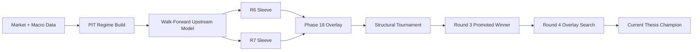
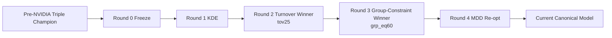

# Decision-Aware Tail Risk Optimization

This repository contains a thesis-oriented portfolio construction pipeline that combines:

- point-in-time regime estimation
- a decision-aware Black-Litterman plus differentiable-CVaR upstream allocator
- a multi-layer Phase 18 overlay for risk control
- winner-survival promotion logic for selecting the final thesis model

## Current Canonical Model

The current final model is the Round 3 promoted `grp_eq60` winner that survived Round 4 unchanged.

Canonical artifacts:

- `results_runpod/nvidia_tournament_round3_group_constraints/promoted_best_result.json`
- `results_runpod/nvidia_tournament_round3_group_constraints/promotion_decision.json`
- `results_runpod/nvidia_tournament_round4_mdd_reopt/search/promotion_decision.json`

Current final metrics:

| Metric | Value |
| --- | ---: |
| Sharpe | 1.0724 |
| Annual return | 10.1035% |
| Max drawdown | -9.4414% |
| Bootstrap P(MDD >= -10%) | 57.98% |

## Visual Overview

### End-to-End Pipeline



### Repository Structure

```mermaid
flowchart TD
    A["Repo Root"] --> B["src/"]
    A --> C["scripts/"]
    A --> D["data/"]
    A --> E["results_runpod/"]
    A --> F["docs/"]
    A --> G["run_walkforward.py"]
    A --> H["README.md"]

    B --> B1["data_loader.py"]
    B --> B2["gen_regime_4state_pit.py"]
    B --> B3["models.py"]
    B --> B4["optimization.py"]
    B --> B5["trainer.py"]
    B --> B6["loss.py"]

    C --> C1["run_phase18_nonleveraged_v2_benchmark.py"]
    C --> C2["run_phase18_nonleveraged_v2_structural_tournament.py"]
    C --> C3["run_nvidia_round0_freeze.py"]
    C --> C4["run_nvidia_round1_kde_full_runpod.sh"]
    C --> C5["run_nvidia_round2_turnover_runpod.sh"]
    C --> C6["run_nvidia_round3_group_constraints_runpod.sh"]
    C --> C7["run_nvidia_round4_mdd_reopt_runpod.sh"]

    E --> E1["phase18_triple_precision_round3/"]
    E --> E2["phase18_triple_verification/"]
    E --> E3["nvidia_tournament_round3_group_constraints/"]
    E --> E4["nvidia_tournament_round4_mdd_reopt/"]

    F --> F1["THESIS_CURRENT_MODEL_PIPELINE.md"]
    F --> F2["COMPLETE_MODEL_DOCUMENTATION.md"]
    F --> F3["NVIDIA_INSPIRED_TOURNAMENT.md"]
```



### Winner Lineage



## Start Here

For the thesis-safe, end-to-end description of the current model, read:

- `docs/THESIS_CURRENT_MODEL_PIPELINE.md`

Additional project references:

- `docs/COMPLETE_MODEL_DOCUMENTATION.md`
- `docs/NVIDIA_INSPIRED_TOURNAMENT.md`
- `docs/ROBUST_TRIPLE_STRATEGY.md`

## Code Map

Core pipeline files:

- `run_walkforward.py`
- `src/data_loader.py`
- `src/gen_regime_4state_pit.py`
- `src/models.py`
- `src/optimization.py`
- `src/trainer.py`
- `src/loss.py`
- `scripts/run_phase18_nonleveraged_v2_benchmark.py`
- `scripts/run_phase18_nonleveraged_v2_structural_tournament.py`

Tournament runners:

- `scripts/run_nvidia_round0_freeze.py`
- `scripts/run_nvidia_round1_kde_full_runpod.sh`
- `scripts/run_nvidia_round2_turnover_runpod.sh`
- `scripts/run_nvidia_round3_group_constraints_runpod.sh`
- `scripts/run_nvidia_round4_mdd_reopt_runpod.sh`

## Minimal Reproduction

To reproduce the current final model path:

1. Rebuild PIT regime probabilities:

```bash
python -m src.gen_regime_4state_pit --end-date 2026-01-01
```

2. Run the Round 3 group-constraint tournament:

```bash
bash scripts/run_nvidia_round3_group_constraints_runpod.sh
```

3. Run the Round 4 overlay-only search:

```bash
bash scripts/run_nvidia_round4_mdd_reopt_runpod.sh
```

4. Confirm the incumbent survives:

- `results_runpod/nvidia_tournament_round3_group_constraints/promoted_best_result.json`
- `results_runpod/nvidia_tournament_round4_mdd_reopt/search/promotion_decision.json`

## Important Thesis Caveats

These points should be stated explicitly in any thesis or paper draft:

1. `grp_eq60` is a solver-level upstream group constraint, not a hard cap on final executed overlay weights.
2. The Round 3 transformer track is PIT-conditioned, but transformer does not activate the GRU-only end-to-end regime head.
3. Tournament `covid_shock_mdd` is a local window-reset MDD, not a true pre-peak-to-trough shock guard.
4. The final model is a promoted robust winner, not simply the official point-metric tournament winner.
5. Bootstrap improves robustness assessment, but it does not remove post-selection bias.

## Historical Milestones

Older triple-achieving champion:

- `results_runpod/phase18_triple_precision_round3/best_result.json`
- `results_runpod/phase18_triple_verification/verification_report.json`

Current robustness-improved champion:

- `results_runpod/nvidia_tournament_round3_group_constraints/promoted_best_result.json`

## Repository Note

This repository may contain many local experiment artifacts and work-in-progress files. The canonical thesis references are the files listed above and the detailed write-up in `docs/THESIS_CURRENT_MODEL_PIPELINE.md`.
