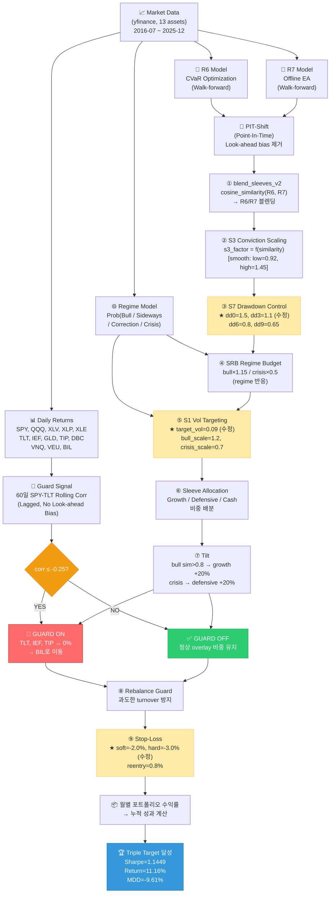
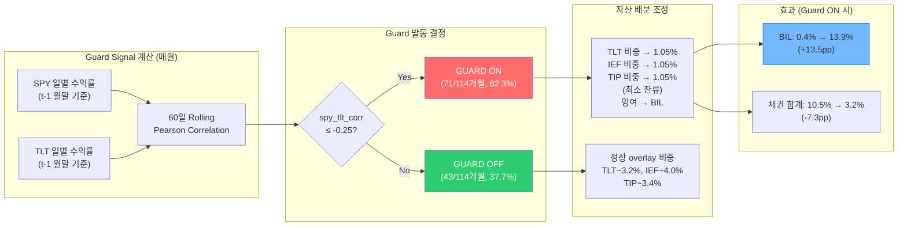
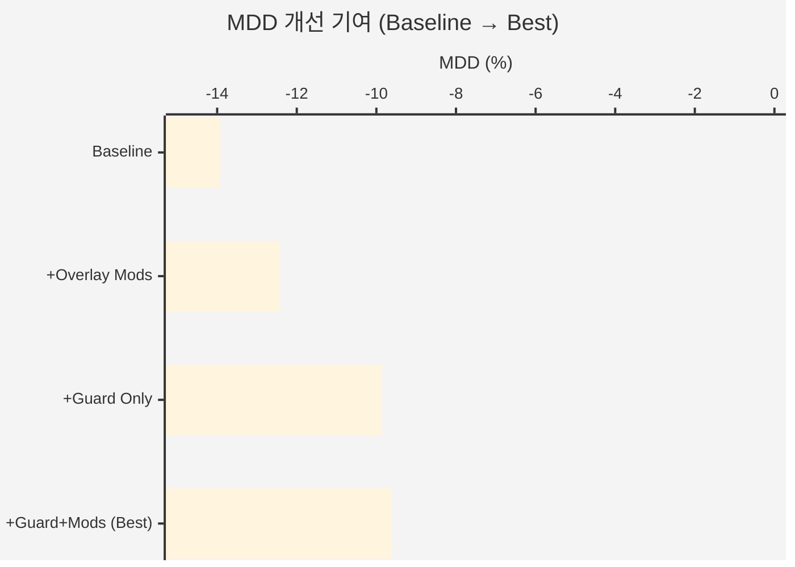

# Model Architecture Diagram
**Best Config: Correlation Guard + Asset Exclusion (Sharpe=1.1449, Return=11.16%, MDD=-9.61%)**

---

## Full Pipeline Flowchart



> ★ 노란색 박스 = Best Config에서 수정된 파라미터

---

## Correlation Guard 상세 로직



---

## Overlay Stack 파라미터 비교 (Baseline vs Best)

```mermaid
%%{init: {"theme": "base"}}%%
xychart-beta
    title "S7 Drawdown Scale Factor"
    x-axis ["dd0 (no DD)", "dd3 (-3%)", "dd6 (-6%)", "dd9 (-9%)"]
    y-axis "Scale" 0 --> 2
    bar [1.1, 1.0, 0.8, 0.65]
    bar [1.5, 1.1, 0.8, 0.65]
```



| 파라미터 | Baseline | Best Config | 방향 |
|----------|----------|-------------|------|
| **S7 dd0** | 1.1 | **1.5** | ↑ Drawdown 없을 때 더 공격적 |
| **S7 dd3** | 1.0 | **1.1** | ↑ |
| S7 dd6 | 0.8 | 0.8 | = |
| S7 dd9 | 0.65 | 0.65 | = |
| **S1 target_vol** | 10% | **9%** | ↓ 약간 보수적 |
| S1 bull_scale | 1.2 | 1.2 | = |
| **Stop soft** | -2.0% | **-2.0%** | = |
| **Stop hard** | -3.5% | **-3.0%** | ↑ 더 빠른 손절 |
| **Guard corr_thresh** | None | **-0.25** | NEW |
| **Exclude assets** | None | **TLT, IEF, TIP** | NEW |

---

## 성능 기여도 분해



| 단계 | Sharpe | Return | MDD | Triple |
|------|--------|--------|-----|--------|
| Baseline | 0.886 | 9.10% | -13.92% | ❌ |
| + Overlay Mods만 | 1.017 | 10.59% | -12.42% | ❌ |
| + Guard만 | 1.027 | 9.84% | -9.86% | ❌ |
| **+ Guard + Mods** | **1.145** | **11.16%** | **-9.61%** | **✅** |

---

## 데이터 흐름 요약 (ASCII)

```
┌─────────────────────────────────────────────────────────────────┐
│                        INPUT LAYER                              │
│  Market Data (13 assets, daily, 2016-07~2025-12, yfinance)     │
└──────────────┬──────────────────────────────┬───────────────────┘
               │                              │
    ┌──────────▼──────────┐       ┌──────────▼──────────┐
    │  Walk-Forward       │       │  Guard Signal        │
    │  R6 (CVaR) weights  │       │  60d SPY-TLT corr   │
    │  R7 (EA)   weights  │       │  (lagged, PIT)       │
    │  → PIT-shift        │       └──────────┬──────────┘
    └──────────┬──────────┘                  │
               │                    corr ≤ -0.25?
    ┌──────────▼──────────────────────────────┐
    │         PHASE 18 OVERLAY STACK          │
    │                                         │
    │  ① blend_sleeves_v2 (cosine sim)        │
    │  ② S3 Conviction (sim → scale)          │
    │  ③ S7 Drawdown ★ dd0=1.5               │
    │  ④ SRB Regime Budget                    │
    │  ⑤ S1 Vol Target ★ vol=0.09            │
    │  ⑥ Sleeve Allocation                    │
    │  ⑦ Tilt                                 │
    │                     ┌───────────────────┤
    │              YES ◄──┤ Guard Active?     ├──► NO
    │              │       └───────────────────┘    │
    │    TLT/IEF/TIP→BIL                    Normal weights
    │              └──────────────┬──────────────────┘
    │  ⑧ Rebalance Guard          │
    │  ⑨ Stop-Loss ★ hard=-3.0%  │
    └──────────────┬──────────────┘
                   │
    ┌──────────────▼──────────────┐
    │       MONTHLY RETURN        │
    │  Σ(weight × asset_return)   │
    └──────────────┬──────────────┘
                   │
    ┌──────────────▼──────────────────────────┐
    │         TRIPLE TARGET ACHIEVED           │
    │  Sharpe = 1.1449  ✅ (target: ≥ 1.0)   │
    │  Return = 11.16%  ✅ (target: ≥ 10%)   │
    │  MDD    = -9.61%  ✅ (target: ≥ -10%)  │
    └──────────────────────────────────────────┘
```
