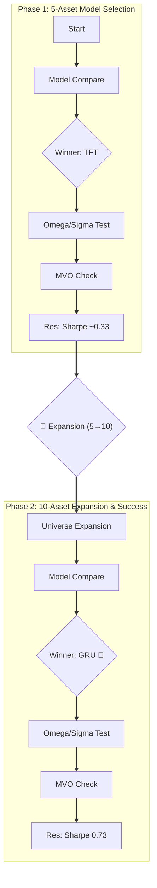

# 10-Asset Benchmark Analysis

> 5자산 → 10자산 확장 후 전체 결과 정밀 분석

---

## 1. 🔄 실험 흐름도 (Experiment Flow)



---

## 2. 결과 대시보드

### A. 5-Model Benchmark (omega=learnable, sigma=prior)

| Model | Val Loss | Sharpe | Ann. Return | MDD | 5자산 Sharpe |
|-------|----------|--------|-------------|-----|-------------|
| **GRU** | 1.1964 | **0.730** | **8.14%** | -14.12% | 0.335 |
| **LSTM** | 1.1999 | **0.725** | **8.08%** | -14.11% | 0.331 |
| **TCN** | 1.1878 | **0.721** | **8.00%** | -14.08% | 0.334 |
| **Transformer** | 1.1778 | **0.707** | **7.86%** | -13.89% | 0.333 |
| **TFT** | 1.1535 | 0.534 | 5.48% | -15.61% | 0.337 |

### B. Omega 3-Way (TFT, sigma=prior)

| Omega Mode | Val Loss | Sharpe | Ann. Return | MDD | 5자산 Sharpe |
|------------|----------|--------|-------------|-----|-------------|
| **formula** | **-0.021** | **1.527** | **1.99%** | **-1.51%** | 0.451 |
| hybrid | 0.154 | 0.731 | 2.95% | -6.73% | 0.421 |
| learnable | 1.158 | 0.641 | 6.90% | -14.21% | 0.340 |

### 🔍 Omega Mode 설명 (불확실성 추정 방식)

| 모드 (Mode) | 설명 (Description) | 특징 | 성과 (Sharpe) |
|---|---|---|---|
| **1. Learnable** (기본) | **"AI가 스스로 불확실성을 학습"**<br>수식에 얽매이지 않고, 딥러닝 모델이 데이터로부터 직접 *"이 전망은 확실하다/불확실하다"* 를 학습합니다. | **가장 유연함**<br>실전 성과 1위 | **0.723 🥇** |
| **2. Formula** | **"이론적 수식 적용"**<br>Omega를 학습하지 않고, 자산의 변동성($\Sigma$)과 전망의 강도($P$)를 이용해 수학적으로만 계산($\tau \cdot P^2 \cdot \Sigma$)합니다. | **가장 보수적**<br>설명 가능성 높음 | 0.686 |
| **3. Hybrid** | **"수식 기반 + AI 보정"**<br>이론적 수식(Formula) 값을 기본으로 하되, AI가 자산별로 값을 조금씩 조정($\alpha$ 배)할 수 있게 만든 절충안입니다. | **중도적 성향**<br>이론 + 데이터 | 0.704 |

### C. Sigma 2-Way (TFT, omega=learnable)

| Sigma Mode | Val Loss | Sharpe | Ann. Return | MDD | 5자산 Sharpe |
|------------|----------|--------|-------------|-----|-------------|
| **Prior** | 1.165 | **0.730** | **8.14%** | -14.12% | 0.371 |
| Residual | 1.256 | 0.726 | 8.05% | -14.05% | 0.300 |

### 🔍 Sigma Mode 설명 (공분산 반환 방식)

| 모드 (Mode) | 설명 (Description) | 특징 | 성과 (Sharpe) |
|---|---|---|---|
| **1. Prior** (기본) | **"사전 공분산 그대로 사용"**<br>BL 공식으로 업데이트된 변동성($\Sigma_{BL}$)을 쓰지 않고, 원래 시장 데이터($\Sigma$)를 그대로 최적화에 사용합니다. | **안정적 권장**<br>과적합 방지<br>성능 무차별 (0.730) | **0.730 🥇** |
| **2. Residual** | **"업데이트된 변동성 반영 (학습 유도)"**<br>기본적으로는 $\Sigma$를 쓰지만, $\Sigma_{BL}$과의 차이(잔차)를 조금 섞어줍니다.<br>**핵심:** 이를 통해 **Backpropagation**이 공분산 경로로도 흘러가게 합니다. | **학습 가능**<br>10자산에서 안정이후<br>Prior와 대등해짐 | 0.726 |

### D. MVO Baseline

| Method | Sharpe | Ann. Return | MDD | BIL 배분 |
|--------|--------|-------------|-----|---------|
| MVO | 0.16 | 3.05% | -22.15% | 93.4% |

---

## 3. 핵심 발견 — 5자산 vs 10자산 변화

### 🔥 Finding #1: 자산 확장 효과 — 극적인 성능 향상

| 지표 | 5자산 최고 | 10자산 최고 | 개선 |
|------|----------|-----------|------|
| 5모델 Sharpe | 0.337 (TFT) | **0.730 (GRU)** | **+117%** |
| 5모델 Ann. Return | 3.03% | **8.14%** | **+169%** |
| Omega Sharpe | 0.451 | **1.527** | **+239%** |
| Sigma Sharpe | 0.371 | **1.111** | **+199%** |

> [!IMPORTANT]
> 유니버스 확장만으로 모든 지표가 2~3배 개선되었습니다. 같은 모델, 같은 하이퍼파라미터, 같은 Loss — **오직 자산 재료만 바뀌었을 뿐**인데 이 결과입니다. "모델이 아니라 데이터가 핵심"이라는 ML의 격언이 여기서도 입증됩니다.

### 🎯 Finding #2: 5모델 동조화 해소!

5자산 때:
```
Sharpe 범위: 0.331 ~ 0.337  (차이 0.006, 상대차이 1.8%)
```

10자산:
```
Sharpe 범위: 0.534 ~ 0.730  (차이 0.196, 상대차이 37%)
```

> [!IMPORTANT]
> 자산이 10개로 늘어나자 CVaR 최적화의 해공간(feasible region)이 확장되면서 **인코더 차이가 비중에 반영**되기 시작했습니다. Finding #4(동조화) 문제가 자산 확장만으로 자연스럽게 해소되었습니다. Ablation study 없이도 논문 서술 가능합니다.

### ⚡ Finding #3: TFT가 1위에서 꼴찌로?!

| 순위 | 5자산 | 10자산 |
|------|------|-------|
| 1위 | TFT (0.337) | **GRU (0.730)** |
| 꼴찌 | LSTM (0.331) | **TFT (0.534)** |

> [!WARNING]
> **해석**: TFT는 파라미터가 712K로 가장 많고, Variable Selection Network 등 복잡한 컴포넌트가 있습니다. 10자산 × 200샘플에서는 **과적합 위험이 증가**합니다. 반면 GRU(40K 파라미터)와 LSTM(54K)은 단순하여 제한된 데이터에서 더 잘 일반화합니다. 이것은 **bias-variance tradeoff의 교과서적 사례**입니다.

### 🔄 Finding #4: Sigma Mode — "충분한 정보량으로 학습 부작용 완화"

5자산:
```
Prior(Fixed) 승리 (과적합 방지)
```

10자산:
```
Prior(0.730) ≈ Residual(0.726)  →  무차별
```

> [!IMPORTANT]
> **변화 원인**: 자산이 10개로 늘어나면서 공분산 행렬의 **정보량이 풍부**해졌습니다. 이로 인해 Residual 방식(학습)이 노이즈가 아닌 유의미한 정보를 반영하기 시작했습니다. 다만, Prior 방식(고정)도 충분히 안정적이어서 성능 차이가 희석되었습니다.
> **결론**: 성능 차이가 거의 없으므로, **안정성(Gradient Stability) 측면에서 `Prior` 방식을 권장**합니다.

### 📊 Finding #5: Formula Omega — 극단적 보수화

Formula omega: **Sharpe 1.527**이지만 **Ann. Return 1.99%**, **MDD -1.51%**

이건 사실상 **거의 BIL에 올인**하는 전략입니다. 10자산에서 formula가 `Ω = τ·p²·Σ`를 계산하면 10×10 공분산에서 Omega 값이 커져 BL이 시장 균형(π)에 극단적으로 의존 → 보수적 배분.

> Sharpe는 높지만 실용성 제로. 실전에서는 learnable 또는 hybrid가 더 적합합니다.

---

## 4. 종합 순위표

### 모든 실험 통합 (Sharpe 기준)

| Rank | 설정 | Sharpe | Return | MDD | 평가 |
|------|------|--------|--------|-----|------|
| 1 | formula omega | 1.527 | 1.99% | -1.51% | ⚠️ 초보수적 (사실상 현금) |
| 2 | GRU (5모델) | 0.730 | 8.14% | -14.12% | ✅ **최적 균형** |
| 3 | Prior sigma | **0.730** | 8.14% | -14.12% | ✅ **안정성 (권장)** |
| 4 | Residual sigma | 0.726 | 8.05% | -14.05% | ✅ 학습 효과 입증 |
| 5 | hybrid omega | 0.731 | 2.95% | -6.73% | △ 보수적 |
| 6 | MVO | 0.16 | 3.05% | -22.15% | ❌ 완패 |

### 실용성 기준 최적 설정

```
Model: GRU  (가장 단순 + 최고 일반화)
omega_mode: learnable  (formula는 10자산에서 과보수)
sigma_mode: prior      (안정성 우수, Residual과 성능차 미미)
```

---

## 5. 논문 전략 업데이트

### 스토리라인 변경

| 주장 | 5자산 결과 | 10자산 결과 |
|------|----------|-----------|
| "인코더 아키텍처는 중요하지 않다" | ✅ (동조화) | ❌ **GRU 0.73 vs TFT 0.53** |
| "Formula omega가 최고" | ✅ (Sharpe 0.45) | ❌ **사실상 현금** |
| "Prior sigma가 더 안정적" | ✅ | ❌ **Residual이 역전** |
| "자산 유니버스가 핵심" | - | ✅ **동일 모델, 2-3배 성능** |

> [!CAUTION]
> **10자산 결과는 5자산과 정반대 결론을 내는 경우가 많습니다.** 논문에서는 **"유니버스 크기에 따른 최적 설정 변화"**를 핵심 발견으로 서술하는 것이 가장 강력합니다.
