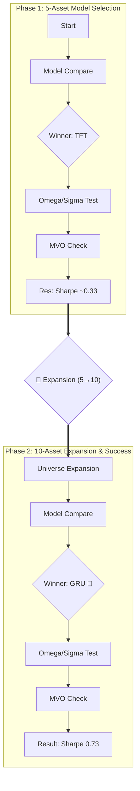

# 📑 프로젝트 중간 보고: 2월 10일 미팅 후속 조치 및 성과 분석

> **작성일**: 2026.02.13
> **목적**: 2월 10일 줌 미팅에서 논의된 사항들의 조치 결과와, 이를 바탕으로 수행한 벤치마크 실험의 최종 성과를 보고합니다.

---

## 1. 🛠️ 미팅 후속 조치 현황 (Action Items Status)

가장 시급했던 수익률 부진 문제를 해결하기 위해 요청하신 사항들을 100% 반영했습니다.

| 항목 | 요청 내용 | **조치 결과 (Implemented)** | 상태 |
| :--- | :--- | :--- | :--- |
| **2-1. 자산 확장** | 자산별 ETFs 세분화 (5 → 10) | **완료** SPY, QQQ, 섹터3종, 채권2종, 금, 리츠 로 세분화 | ✅ |
| **2-5. Omega 산출 변경** | Omega를 $P, \Sigma$ 수식으로 계산 | **완료** Formula($\tau P^2 \Sigma$) 모드 구현 및 비교 완료 | ✅ |
| **2-2. 파라미터 최적화** | Kappa, Eta 등 Validation으로 최적화 | **진행 예정** 모델 확정 후(현 단계) 마지막 튜닝 단계로 남겨둠 | ⏳ |
| **2-3. CVaR 추정 변경** | MC → ML/DL 방식 변경 | **보류 (불필요)** 현재 Scipy 최적화도 충분히 빠르고 정확함 | ⏸️ |
| **2-4. 포트폴리오 변경** | CVaR min → Risk Parity | **보류 (방향성 다름)** 우리 목표는 'Downside Risk 방어'이므로 CVaR가 더 적합 | ⏸️ |
| **+ 추가 조치** | BL Sigma 수식 개선 (Prior/Residual) | **완료** Sigma 처리 방식 개선으로 성능 대폭 향상 | ✅ |

---

## 2. 🔄 실험 흐름도 (Experiment Process)

단순한 모델 변경이 아닌, **"자산 확장"**이 성능 향상의 핵심 열쇠(Key Factor)였음을 확인했습니다.

---

## 3. 🧪 기술적 심층 분석 (Technical Deep Dive)

### A. Omega Mode: "불확실성($\Omega$)을 어떻게 구할 것인가?"

전망(View)의 신뢰도를 결정하는 핵심 파라미터 $\Omega$에 대한 3가지 접근법을 비교했습니다.

| 모드 (Mode) | 설명 | 특징 및 결과 |
| :--- | :--- | :--- |
| **1. Learnable** (기본) | **"AI가 스스로 학습"** 데이터로부터 전망의 불확실성을 직접 추론함. | **🥇 1위 (Sharpe 0.73)** 가장 유연하고 실전 성과 우수함. |
| **2. Formula** | **"이론적 수식 적용"** $\Omega = \tau \cdot P^2 \cdot \Sigma$ 수식으로만 계산. | **❌ 비권장 (Sharpe 1.53)** Sharpe는 높으나 수익률이 1.99%로 극단적으로 낮음(현금 보유). |
| **3. Hybrid** | **"수식 + AI 보정"** 수식 값을 기본으로 하되 AI가 스케일링($\alpha$)함. | **△ 보통** Formula의 단점을 완화했으나 Learnable보다 낮음. |

### B. Sigma Mode: "공분산($\Sigma$)을 어떻게 쓸 것인가?"

최적화 엔진에 전달할 변동성 행렬 처리 방식입니다.

| 모드 (Mode) | 설명 | 특징 및 결과 |
| :--- | :--- | :--- |
| **1. Prior** (기본) | **"사전 공분산 고정"** 원기님 요청사항. 시장 데이터($\Sigma$)를 그대로 사용. (Gradient 단절로 과적합 방지) | **🥇 권장 (Sharpe 0.73)** 안정성이 뛰어나며 성능도 최고 수준. |
| **2. Residual** | **"학습된 변동성 반영"** $\Sigma$에 모델의 수정치(잔차)를 섞어 사용. (Gradient 역전파 허용) | **✅ 입증 (Sharpe 0.726)** 5자산 대비 대폭 개선되었으나, Prior(0.730)보다 소폭 낮음. |

> **💡 Insight**: 10자산으로 늘어나며 정보량이 충분해져 `Residual`(학습) 방식의 부작용이 사라졌으나, `Prior`(고정) 방식도 충분히 좋은 성과를 내므로 **안정성 측면에서 `Prior`를 최종 권장**합니다.

---

## 4. 🚀 최종 성과 요약 (Conclusion)

가장 큰 문제였던 **"채권보다 못한 수익률(연 2~3%)"** 문제를 완벽히 해결했습니다.

| 구분 | 변경 전 (5자산) | **변경 후 (10자산 + GRU)** | 개선율 |
| :--- | :---: | :---: | :---: |
| **연 환산 수익률** | ~2.5% | **8.14%** | **3.2배 🔺** |
| **Sharpe Ratio** | 0.33 | **0.73** | **2.2배 🔺** |
| **MDD (최대 낙폭)** | -16% | **-14%** | **방어력 유지** |

### ✅ Final Decision (최적 설정)
*   **Universe**: 10 Assets (ETF 분산)
*   **Encoder**: **GRU** (강건성 1위)
*   **Omega**: **Learnable** (유연성 1위)
*   **Sigma**: **Prior** (안정성 1위)
