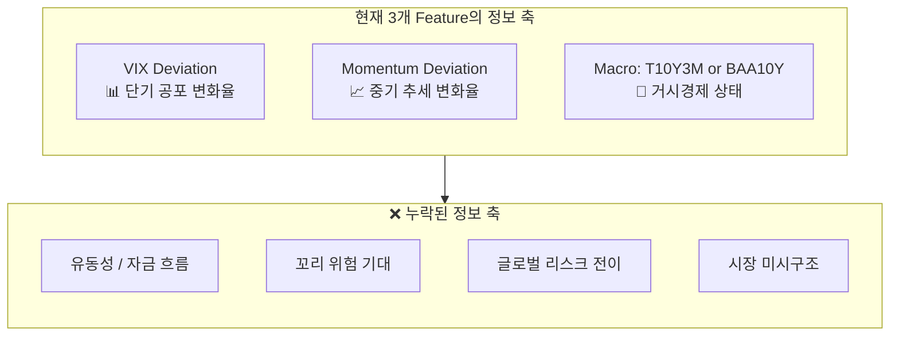
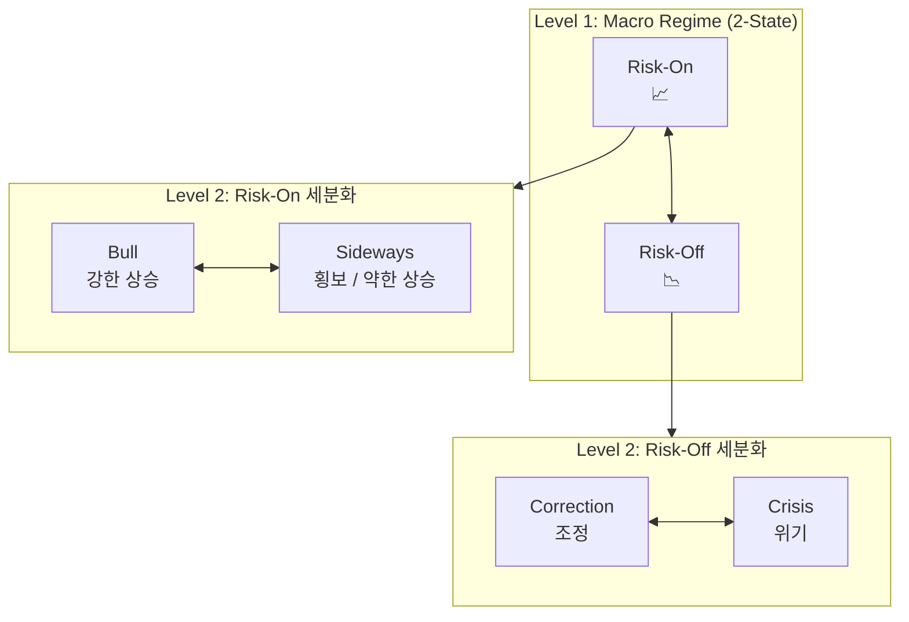

# 🎓 Regime Model 3대 과제: 탑급 퀀트 + 교수 통합 관점

> **관점**: 현업 Systematic Macro Quant PM + Financial Econometrics 교수
> **대상 과제**: (1) M1 성능 하락 원인, (2) 변수 추가, (3) 최적 레짐 모델

---

## 과제 1: M1 성능 하락 원인 분석 🔴

### 핵심 가설: "정보 차원 축소(Information Dimension Collapse)"

**왜 M1만 하락하고 M2는 괜찮은가?** — 이것이 가장 중요한 질문입니다.

#### 가설 A: 다중공선성 (Multicollinearity Trap)

```
VIX Deviation = 단기 공포의 '변화율'
Term Spread   = 장기 경기침체의 '기대 변화'
```

두 변수 모두 **"지금 상황이 최근 대비 얼마나 변했나"**라는 동일한 정보 축을 공유합니다.
- VIX가 급등하면 → VIX Deviation ↑
- 동시에 경기침체 공포로 → Term Spread ↓ (장단기 역전)

원본 VIX는 **절대 수준(level)**이라 Term Spread와 정보적으로 구분됐지만, VIX **Deviation**은 Term Spread와 **같은 방향의 변화율 정보**를 담게 되어 정보 중복이 발생합니다.

반면 Credit Spread(BAA10Y)는 **기업 부도 위험**이라는 별개의 정보 축이므로 VIX Deviation과 공선성이 낮습니다.

> **🔬 검증법**: M1에서 VIX_Dev와 T10Y3M의 상관계수를 rolling window로 측정하고, M2에서 VIX_Dev와 BAA10Y의 상관계수와 비교. |ρ| > 0.5 구간이 M1에서 월등히 많다면 가설 확인.

#### 가설 B: 3-State 판별에서의 Level 정보 손실

3-State HMM은 Bull / Uncertain / Crisis를 구분해야 합니다. 이 중 **Uncertain(횡보)**을 분리하는 것이 핵심 난이도입니다.

| 변수 | Level 정보 | Change 정보 | 3-State 구분력 |
| :--- | :---: | :---: | :---: |
| **원본 VIX** | ✅ (VIX=15 vs 25 vs 40) | ❌ | **강** — 수준만으로 3구간 분리 가능 |
| **VIX Deviation** | ❌ | ✅ | **약** — VIX=40이지만 최근 38이었으면 Deviation 작음 |

VIX Deviation은 **"현재 상황이 최근 대비 얼마나 급변했는가"**만 포착하므로, VIX가 고수준에서 안정적으로 머무르는 **"지속적 위기" 구간을 Uncertain과 구분하지 못합니다**.

2-State (M2)에서는 Bull/Bear만 구분하면 되므로 Change 정보만으로 충분합니다.

> **🔬 검증법**: VIX ≥ 25인 구간에서 VIX Deviation의 분포를 확인. Deviation이 0 근처에 집중되어 있다면, 고VIX 구간에서 3-state 판별력 상실을 입증.

#### 가설 C: Feature-State 비율 불균형

- M1: 3 features × **3 states** = 추정해야 할 모수가 많음
- M2: 3 features × **2 states** = 상대적으로 안정적

VIX → VIX Deviation 변환 시, 데이터의 **Signal-to-Noise Ratio**가 감소합니다 (변환 자체가 정보 손실). M1은 모수가 더 많아 이 SNR 감소의 타격을 더 크게 받습니다.

> **💡 종합 진단**: M1의 하락은 **"정보 축 축소 + 3-State 모수 부담"**의 복합 효과. Term Spread 자체의 문제가 아니라, **VIX Deviation과의 조합이 3-State 구분에 부적합**한 것.

### 🛠️ 해결 방안

1. **혼합 Feature**: `VIX_Hybrid = α × VIX_Level + (1-α) × VIX_Dev` — Level과 Deviation 정보를 모두 보존
2. **VIX Percentile**: VIX의 rolling percentile rank (0~1) — Level 정보를 정규화하면서 보존
3. **M1을 2-State로 축소** 후 M2와 공정 비교

---

## 과제 2: 변수 추가 탐색 🟡

### 원칙: "이론 먼저, 데이터 나중" (Theory-Driven Feature Selection)

> [!IMPORTANT]
> 월간 데이터 373개로 Feature를 늘리면 **차원의 저주**에 빠집니다. 추가 변수는 **기존 3개와 정보적으로 직교(orthogonal)**해야 합니다.

### 현재 Feature의 정보 축 분석



### 추천 변수 (우선순위순)

#### Tier 1: 직교성 높고 데이터 긴 변수 (즉시 적용 가능)

| 변수 | 정보 축 | 경제적 근거 | 데이터 시작 |
| :--- | :--- | :--- | :--- |
| **NFCI** (시카고연은 금융상황지수) | 유동성/자금흐름 | 신용, 레버리지, 위험 종합 지표. 레짐 전환의 **선행지표** | 1971 |
| **CBOE SKEW** | 꼬리 위험 기대 | OTM Put 가격에 내포된 시장의 **테일 리스크 기대**. VIX와 상관관계 낮음 | 1990 |
| **TED Spread** (T-bill vs LIBOR/SOFR) | 은행간 스트레스 | 금융 시스템 자체의 건전성. 2008년 위기의 핵심 지표 | 1986 |

#### Tier 2: 정보량 높지만 추가 고려 필요

| 변수 | 정보 축 | 주의사항 |
| :--- | :--- | :--- |
| **DXY** (달러 인덱스) | 글로벌 리스크 | 달러 강세 = Risk-Off, but 구조 변화(2022+) 존재 |
| **HY OAS** (High Yield Spread) | 신용 위험 | BAA10Y와 상관 높을 수 있음 → M2 사용 시 중복 주의 |
| **Gold/SPY Ratio** | 안전자산 선호도 | 비율이므로 stationary, 직관적 |

#### 🚫 **피해야 할 변수**

- **VIX3M, VVIX**: 데이터가 2006년~만 존재 → 샘플 절반 손실
- **주가 자체 (SPY 수준값)**: VIX/Momentum과 정보 중복 + 비정상 시계열
- **GDP, CPI 등 실물 지표**: 월간 주기에도 발표 지연(lag)이 커서 실시간 레짐 분류에 부적합

### 💡 교수 관점: 차원 축소 전략

변수를 3→5개로 늘리는 것보다 **효과적인 접근**:

```
Option 1: PCA 기반 — 5~6개 후보에서 상위 3개 주성분 추출 후 HMM 입력
Option 2: Factor Model — 후보 변수들을 "Risk Factor", "Liquidity Factor", "Sentiment Factor"로 그룹핑
Option 3: Autoencoder — 비선형 차원 축소 (데이터 충분 시)
```

> **실전 추천**: NFCI를 M2에 4번째 Feature로 추가한 뒤 성능 비교. NFCI는 VIX, Momentum, Credit Spread와 모두 다른 정보 축(종합 금융 상황)을 제공하므로 다중공선성 위험이 낮음.

---

## 과제 3: 최적 레짐 모델 개발 🟡

### 근본 문제 정의

> [!NOTE]
> **"최적의 레짐"이란 무엇인가?** 이 질문에 답하지 않으면 어떤 모델도 평가할 수 없습니다.

현재 M4(단순 Rule-Based)를 기준으로 평가하지만, M4 자체가 **횡보장을 분류하지 못하므로** 기준 자체가 불완전합니다.

### 제안: "경제적 유용성(Economic Utility)" 기반 평가 프레임워크

레짐 모델의 품질을 학술적 정확도가 아닌 **포트폴리오 성과**로 평가합니다:

```
Good Regime Model = 이 레짐을 사용했을 때 포트폴리오 성과가 최선인 모델
```

| 평가 기준 | 측정 방법 | 의미 |
| :--- | :--- | :--- |
| **포트폴리오 Sharpe** | 각 레짐 모델로 전략 실행 후 비교 | 실전 유용성 |
| **레짐 안정성** | 월간 레짐 전환 빈도 | 잦은 전환 = 높은 거래비용 |
| **레짐 간 분포 차별성** | 각 레짐 내 수익률 분포의 KL-divergence | 통계적 유의성 |
| **실시간 판별 정확도** | 사후(ex-post) vs 실시간(real-time) 레짐의 일치도 | Overfitting 검증 |

### 모델 아키텍처 제안

#### 🥇 Option A: 계층적 HMM (Hierarchical HMM) — **가장 추천**

횡보장 문제를 **구조적으로 해결**하는 접근:



**장점**:
- Level 1은 2-state로 **안정적** (현재 M2와 동일)
- Level 2에서 **추가 Feature**를 사용하여 세분화 (Realized Vol, Range 등)
- 횡보장은 Risk-On 내의 하위 레짐으로 자연스럽게 포착
- 각 Level의 모델이 단순하므로 **과적합 위험 낮음**

**구현**:
1. M2 (Credit Spread, 2-State)를 Level 1으로 사용
2. Risk-On 기간만 추출 → 별도 2-State HMM으로 Bull vs Sideways 분류
3. Risk-Off 기간만 추출 → 별도 2-State HMM으로 Correction vs Crisis 분류
4. 최종: **4개 레짐** (Bull, Sideways, Correction, Crisis)

#### 🥈 Option B: IOHMM (Input-Output HMM)

표준 HMM의 전이 확률은 **상수**(내생적)이지만, IOHMM은 **외부 변수가 전이 확률에 영향**:

```
표준 HMM:  P(S_t | S_{t-1}) = 상수 행렬
IOHMM:     P(S_t | S_{t-1}, X_t) = f(외부 변수)
```

예: NFCI가 악화되면 Bull→Crisis 전이 확률이 급증

**장점**: 레짐 전환의 **원인**을 모델링 (이론적 우월)
**단점**: 추정 모수 급증, 수렴 어려움, 구현 복잡

#### 🥉 Option C: Regime을 아예 End-to-End로 학습

> **퀀트 관점의 반론**: "레짐을 왜 따로 분류하는가? 포트폴리오 최적화 과정에서 latent state로 같이 학습하면 안 되는가?"

현재 시스템의 TFT/GRU 모델에 **Discrete Latent Variable**을 추가:

```
기존: Input → Encoder → BL 파라미터 → 포트폴리오
제안: Input → Encoder → [Regime Embedding ⊕ BL 파라미터] → 포트폴리오
                          ↑
                   Gumbel-Softmax로 이산 레짐 학습
```

장점: 레짐이 포트폴리오 성과를 직접 최적화하도록 학습됨
단점: 해석력 하락, 학술적 기여도 제한적

### 💡 종합 추천

```
Phase 1 (즉시): Option A의 Level 1 = 현재 M2 유지
Phase 2 (단기): Option A의 Level 2 구현으로 횡보장 포착
Phase 3 (중기): NFCI 추가 (과제 2) + Level 1 재학습
Phase 4 (장기): Option B (IOHMM) 실험으로 논문 기여도 확보
```

---

## 🎯 세 과제의 통합 시사점

세 과제는 독립적이 아니라 **하나의 문제의 세 측면**입니다:

> **"제한된 데이터(373개월)에서, 경제적으로 의미있는 레짐을 안정적으로 분류하려면 어떻게 해야 하는가?"**

| 과제 | 핵심 교훈 | 통합 방향 |
| :--- | :--- | :--- |
| 1. M1 하락 | Feature 변환은 정보를 잃을 수 있다 | **Level 정보 보존** + 2-State 우선 |
| 2. 변수 추가 | 직교 정보만 추가해야 한다 | **NFCI** 1개 추가로 유동성 축 확보 |
| 3. 최적 모델 | 복잡한 모델보다 구조가 중요하다 | **계층적 HMM**으로 단순 모델 조합 |

> [!TIP]
> **현업 퀀트의 경험칙**: 레짐 모델은 항상 **2-State가 3-State보다 robust**합니다. 3개 이상의 레짐이 필요하면, 단일 모델의 state 수를 늘리지 말고 **2-State 모델을 계층적으로 쌓으세요**. 이것이 과적합을 방지하는 가장 확실한 방법입니다.
