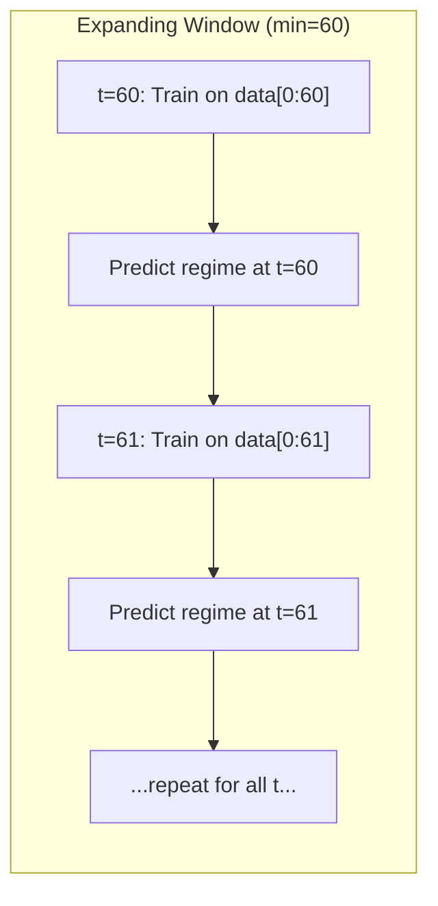

# 🔍 Regime Classifier Ver2 분석 보고서

> **분석 대상**: [Regime_Classifier_Ver2.ipynb](file:///c:/Users/Jun/Desktop/Thesis/Projects/Decision-Aware-Tail-Risk-Optimization/notebooks/Regime_Classifier_Ver2.ipynb)
> **참조**: 준상 2월 10일 미팅 노트
> **작성일**: 2026.02.13

---

## 1. 📊 노트북 구조 요약

노트북은 **2개의 주요 코드 셀**로 구성되어 있으며, 각각 독립적인 `RobustRegimeClassifier` 클래스를 정의합니다.

| 모델 | Macro 변수 | States | 레짐 라벨 |
| :--- | :--- | :---: | :--- |
| **M1** (Term Spread) | T10Y3M | 3 | Bull, Uncertain, Crisis |
| **M2** (Credit Spread) | BAA10Y | 2 | Bull, Bear |

> [!IMPORTANT]
> 두 모델 모두 공통 Feature로 **VIX Deviation**과 **Momentum Deviation**을 사용합니다. 이전 버전에서 사용하던 잘못된 변수들이 수정된 결과입니다.

---

## 2. 🧬 입력 변수 변경 사항 (Key Change)

### 변경 전 → 변경 후

```diff
- VIX (원본 수준값)
+ VIX Deviation = (VIX - VIX_3M_MA) / VIX_3M_MA

- Momentum (미확인)
+ Momentum Deviation = (SPY_Close - SPY_12M_MA) / SPY_12M_MA

  Macro: T10Y3M (Term Spread) — M1
  Macro: BAA10Y (Credit Spread) — M2
```

### 변경 이유 (준상 노트 기반)

1. **VIX → VIX Deviation**: 원본 VIX는 특정 레짐에 "고착(stick)"되는 경향이 있음. 3개월 이동평균 대비 편차로 변환하면 **급격한 스파이크(공포 발작)**를 더 잘 포착함.
2. **Panic Ratio (VIX/VIX3M) 미사용**: VIX3M 데이터가 2006년부터만 존재하여 데이터 유니버스가 너무 제한적. VIX Deviation이 대안으로 채택됨.
3. **기존 변수 오류 수정**: 여러 모델에서 공통으로 사용되던 잘못된 변수들이 수정됨.

---

## 3. ⚙️ 모델 아키텍처 상세

### 공통 구조: Expanding Window HMM



### 핵심 파라미터

| 파라미터 | 값 | 설명 |
| :--- | :--- | :--- |
| `n_components` | M1: **3** / M2: **2** | 레짐 수 |
| `covariance_type` | `diag` | 대각 공분산 행렬 |
| `n_iter` | 1000 | EM 알고리즘 최대 반복 |
| `tol` | 1e-4 | 수렴 허용 오차 |
| `min_covar` | 1e-3 | 최소 공분산 |
| `n_restarts` | 5 | 랜덤 초기화 재시작 횟수 |
| `min_window` | 60 | 최소 학습 윈도우 (60개월 = 5년) |

### Dynamic State Re-ordering (상태 재정렬)

각 시점마다 HMM이 재학습되므로 state 번호와 실제 레짐의 매핑이 달라질 수 있습니다. 이를 해결하기 위한 핵심 로직:

```
Risk Score = mean(VIX_Dev) - mean(Momentum)
```

- **높은 Risk Score** → 높은 VIX 편차 + 낮은 모멘텀 = **위기 레짐**
- **낮은 Risk Score** → 낮은 VIX 편차 + 높은 모멘텀 = **강세 레짐**

이 방식으로 매 시점 자동으로 states를 Bull → Uncertain → Crisis (또는 Bull → Bear) 순서로 정렬합니다.

---

## 4. 📈 실행 결과 분석

### M1 (Term Spread + 3 States)
- **데이터**: 373 rows × 4 features (VIX_Dev, Momentum, T10Y3M, SPY)
- **학습**: 313 time steps (expanding window)
- **수렴 경고**: 다수 발생 (`Model is not converging`) — EM 알고리즘의 로컬 옵티마 이슈로, random restart로 완화

### M2 (Credit Spread + 2 States)
- **데이터**: 373 rows × 4 features (VIX_Dev, Momentum, BAA10Y, SPY)
- **학습**: 313 time steps
- **수렴 경고**: M1보다 적게 발생 — 2-state가 3-state보다 모수 추정이 안정적

---

## 5. 🎯 모델 선택: M2 (Credit Spread) 권장

### 준상 노트 기반 근거

| 평가 기준 | M1 (Term Spread) | M2 (Credit Spread) |
| :--- | :--- | :--- |
| **Kappa Score** | 낮음 | **높음** ✅ |
| **VIX Deviation 사용 시 성능** | **하락** ❌ | 영향 적음 |
| **직관적 해석력** | 보통 | **우수** |

> [!WARNING]
> **M1 성능 하락 원인 미해결**: VIX → VIX Deviation 변경 시 M1의 성능이 유의미하게 하락한 원인을 분석해야 합니다. 이는 Term Spread가 VIX Deviation과의 조합에서 정보 중복(multicollinearity)이 발생할 가능성이 있습니다.

### Kappa Score 해석 (Table 1 from Notes)

| Kappa 범위 | 해석 |
| :--- | :--- |
| < 0 | 우연보다 못한 일치도 |
| 0.00 – 0.20 | Slight |
| 0.21 – 0.40 | Fair |
| 0.41 – 0.60 | Moderate |
| 0.61 – 0.80 | Substantial |
| 0.81 – 1.00 | Almost Perfect |

---

## 6. 🔬 레짐 평가 방법론

### 현재 방식의 한계
- **M4 (단순 분류)** 기반 유사도 측정: M4와의 mismatch를 기준으로 M1/M2 평가
- M4는 **횡보장(sideways market)**을 분류하지 못하므로, M1/M2와의 비교에 근본적 한계 존재

### 평가 다양화 (준상 제안)
1. **Kappa Score**: 레짐 분류의 일치도를 통계적으로 측정
2. **Correlation**: 레짐 확률과 실제 시장 움직임 간의 상관관계

> [!NOTE]
> 근본적 질문: "최적의 레짐 분류 기준이 무엇인가?" — 직관적 이해를 넘어선 복잡한 모델이 실제로 필요한지에 대한 고민이 필요합니다.

---

## 7. 📋 Next Steps (향후 과제)

| 순서 | 과제 | 우선순위 |
| :---: | :--- | :---: |
| 1 | **M1 성능 하락 원인 분석**: VIX Deviation 사용 시 M1이 왜 성능이 떨어지는지 규명 | 🔴 High |
| 2 | **변수 추가 탐색**: 추가 macro/market 변수로 레짐 분류 정확도 향상 | 🟡 Medium |
| 3 | **최적 레짐 모델 개발**: M4 대체 가능한 모델 구축 (횡보장 포착) | 🟡 Medium |
| 4 | **IOHMM 도입**: Input-Output HMM으로 외부 변수를 직접 전이 행렬에 반영 | 🟢 Low |
| 5 | **하이퍼파라미터 튜닝**: Kappa, Eta 등 Validation set 기반 최적화 | ⏳ 모델 확정 후 |
| 6 | **2024 Out-of-Sample 테스트**: 미사용 데이터로 최종 검증 | ⏳ 마지막 단계 |

---

## 8. 💡 핵심 관찰 사항

### 노트북 코드 vs. 준상 노트 상이점

> [!CAUTION]
> 준상 노트에서는 M2를 "**Credit Spread + 3 States**"로 기술했으나, 실제 노트북 코드에서 M2는 `n_states=2` (Bull, Bear)로 구현되어 있습니다. 이 차이가 의도적인 것인지 확인이 필요합니다.
>
> - **노트**: M2 = Credit Spread + **3 States**
> - **코드**: M2 = Credit Spread + **2 States**

### Feature Engineering 특이점
- VIX Deviation은 **비율 기반 편차**(%)로 계산되어, VIX 수준값 대비 스케일에 덜 민감
- Momentum도 마찬가지로 **비율 기반 편차**로 계산
- 이 두 feature 모두 StandardScaler로 정규화된 후 HMM에 입력됨
- 데이터는 **월간 리샘플링**된 시계열 사용
